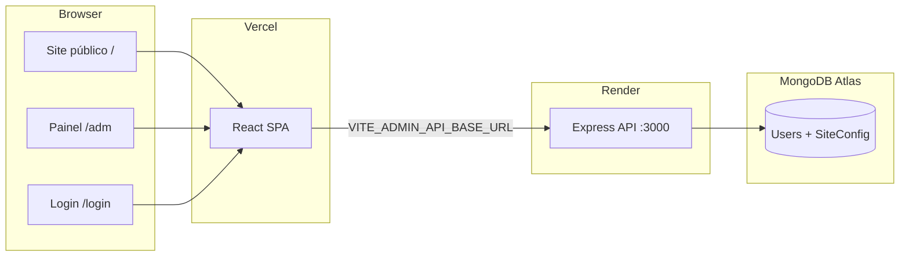

# Projeto Arquice

Site institucional da **Associação Remanescente Quilombola de Curralinho Morrinhos (Arquice)**, com painel administrativo para editar textos, contactos, imagens e configurações do site sem alterar código.

## Visão geral

| Camada | Tecnologia | Deploy |
|--------|------------|--------|
| Frontend | React 19, TypeScript, Vite, Tailwind CSS, shadcn/ui | [Vercel](https://vercel.com) |
| Backend | Node.js, Express, Mongoose | [Render](https://render.com) |
| Base de dados | MongoDB Atlas | MongoDB Cloud |



## Estrutura do projeto

```
Projeto-Arquice/
├── src/                    # Frontend React
│   ├── components/         # Componentes do site público
│   ├── config/siteConfig.ts # Valores estáticos (fallback / build)
│   ├── admin/              # API client e tipos do painel
│   ├── pages/              # Rotas (Home, Login, Admin, etc.)
│   ├── contexts/           # AuthContext (JWT)
│   └── lib/api.ts          # Base URL da API
├── backend/                # API Express
│   ├── routes/             # auth, site-config, upload
│   ├── models/             # User, SiteConfig
│   └── middleware/         # JWT + role admin
├── docs/                   # Documentação técnica
├── GUIA_CONFIGURACAO.md    # Guia para editores (sem código)
└── CONFIGURACAO_EMAIL.md   # Email do formulário de voluntários
```

## Pré-requisitos

- **Node.js** 18+ (recomendado 20+)
- **npm**
- Conta **MongoDB Atlas** (ou MongoDB local)
- Para deploy: contas Vercel e Render

## Início rápido (desenvolvimento local)

### 1. Backend

```bash
cd backend
cp .env.example .env
# Edite backend/.env com MONGODB_URI, JWT_SECRET, etc.
npm install
npm run dev
```

O servidor sobe em `http://localhost:3000`.

### 2. Frontend

```bash
# Na raiz do projeto
cp .env.example .env
# Defina VITE_ADMIN_API_BASE_URL=http://localhost:3000
npm install
npm run dev
```

O site abre em `http://localhost:5173`.

> **Importante:** use o **mesmo URL** no `.env` do front e no Postman. Se o backend corre localmente, aponte para `http://localhost:3000`. Após alterar o `.env`, reinicie o Vite.

### 3. Criar utilizador admin

Registe um utilizador via Postman ou curl:

```bash
curl -X POST http://localhost:3000/api/auth/register \
  -H "Content-Type: application/json" \
  -d '{"email":"admin@exemplo.com","password":"senha123"}'
```

Por defeito o role é `user`. Para aceder ao painel (PUT, upload), altere o campo `role` para `admin` diretamente no MongoDB.

### 4. Aceder ao painel

1. Abra `http://localhost:5173/login`
2. Faça login
3. Será redirecionado para `/adm`

## Rotas do frontend

| Rota | Acesso | Descrição |
|------|--------|-----------|
| `/` | Público | Página inicial |
| `/privacidade` | Público | Política de privacidade |
| `/login` | Público | Autenticação admin |
| `/forgot-password` | Público | Recuperação de senha |
| `/reset-password?token=...` | Público | Redefinir senha |
| `/adm` | Protegido (JWT) | Painel de configuração do site |

A rota `/adm` não tem link no site público — é acessível apenas por URL directa.

## Variáveis de ambiente

### Frontend (raiz — `.env`)

| Variável | Obrigatória | Descrição |
|----------|-------------|-----------|
| `VITE_ADMIN_API_BASE_URL` | Sim (produção) | URL do backend **sem** barra final |

Ver [`.env.example`](.env.example).

### Backend (`backend/.env`)

| Variável | Obrigatória | Descrição |
|----------|-------------|-----------|
| `MONGODB_URI` | Sim | Connection string MongoDB Atlas |
| `JWT_SECRET` | Sim | Segredo do access token (15 min) |
| `JWT_REFRESH_SECRET` | Sim | Segredo do refresh token (7 dias) |
| `EMAIL_HOST` | Para reset senha | SMTP (ex.: `smtp.gmail.com`) |
| `EMAIL_PORT` | Para reset senha | Porta SMTP (ex.: `587`) |
| `EMAIL_USER` | Para reset senha | Utilizador SMTP |
| `EMAIL_PASS` | Para reset senha | Senha de app |
| `PORT` | Não | Porta do servidor (default `3000`) |
| `API_BASE_URL` | Não | URL pública para links de upload em produção |

Ver [`backend/.env.example`](backend/.env.example).

## API (resumo)

Base: `{VITE_ADMIN_API_BASE_URL}/api`

| Método | Endpoint | Auth | Descrição |
|--------|----------|------|-----------|
| POST | `/auth/register` | — | Registar utilizador |
| POST | `/auth/login` | — | Login → `accessToken` |
| POST | `/auth/forgot-password` | — | Enviar email de reset |
| POST | `/auth/reset-password` | — | Redefinir senha |
| PUT | `/auth/change-password` | JWT | Alterar senha |
| PUT | `/auth/change-email` | JWT | Alterar email |
| GET | `/site-config` | — | Ler configuração |
| PUT | `/site-config` | JWT + admin | Gravar configuração |
| POST | `/upload` | JWT + admin | Upload de imagem |

Documentação completa: [`backend/README.md`](backend/README.md) e [`src/admin/BACKEND_INTEGRATION.md`](src/admin/BACKEND_INTEGRATION.md).

## Deploy

Frontend na **Vercel**, backend no **Render**, base de dados no **MongoDB Atlas**.

Passo a passo: [`docs/DEPLOYMENT.md`](docs/DEPLOYMENT.md).

## Documentação adicional

| Documento | Público-alvo |
|-----------|--------------|
| [`GUIA_CONFIGURACAO.md`](GUIA_CONFIGURACAO.md) | Editores sem conhecimento técnico (editar `siteConfig.ts`) |
| [`CONFIGURACAO_EMAIL.md`](CONFIGURACAO_EMAIL.md) | Configuração do email de voluntários (FormSubmit) |
| [`docs/ADMIN.md`](docs/ADMIN.md) | Utilização do painel `/adm` |
| [`docs/DEPLOYMENT.md`](docs/DEPLOYMENT.md) | Deploy Vercel + Render |
| [`backend/README.md`](backend/README.md) | API REST detalhada |
| [`src/admin/BACKEND_INTEGRATION.md`](src/admin/BACKEND_INTEGRATION.md) | Contrato JSON do painel admin |

## Scripts úteis

```bash
# Frontend
npm run dev       # Desenvolvimento
npm run build     # Build de produção
npm run preview   # Pré-visualizar build
npm run lint      # ESLint

# Backend
cd backend && npm run dev    # Desenvolvimento (nodemon)
cd backend && npm start      # Produção
```

## Resolução de problemas

| Sintoma | Causa provável | Solução |
|---------|----------------|---------|
| "Credenciais inválidas" | URL diferente entre Postman e front | Alinhar `VITE_ADMIN_API_BASE_URL` com o URL do Postman |
| "Não foi possível ligar à API" | Env em falta, CORS ou rede | Verificar `.env`, reiniciar Vite, confirmar CORS no Render |
| Formulário `/adm` fica em branco | API devolve config vazia | Normal antes do primeiro "Guardar"; valores vêm de `siteConfig.ts` |
| Upload com URL `localhost` em produção | `API_BASE_URL` não definido no Render | Definir `API_BASE_URL` no backend |

## Licença

Projeto privado — Associação Arquice.
