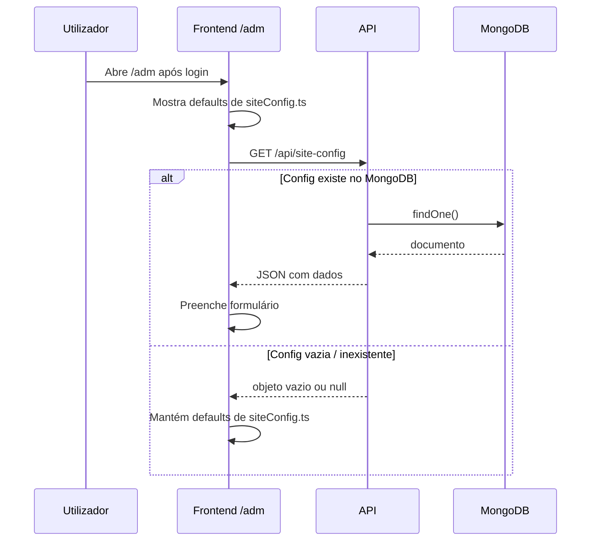

# Painel de administração (`/adm`)

Guia de utilização do painel interno para gestão do conteúdo do site Arquice.

## Acesso

- **URL:** `https://seu-site.vercel.app/adm` (ou `http://localhost:5173/adm` em desenvolvimento)
- **Login:** `/login` — não há link público para o painel
- **Requisito:** utilizador com `role: "admin"` na base de dados

## Funcionalidades

### Abas do formulário

| Aba | Conteúdo |
|-----|----------|
| Geral | Nome, descrição, CNPJ, emails, telefone |
| Endereço | Rua, bairro, cidade, estado |
| Redes | Instagram e outras redes |
| Imagens | Logo, banner, fotos das secções |
| Conta | Alterar senha e email |

### Botões principais

| Botão | Acção |
|-------|-------|
| **Recarregar do servidor** | `GET /api/site-config` — busca dados do MongoDB |
| **Guardar** | `PUT /api/site-config` — grava alterações (requer JWT admin) |
| **Logout** | Termina sessão e redireciona para `/login` |

### Upload de imagens

Na aba Imagens, ao seleccionar um ficheiro, o front envia para `POST /api/upload` e actualiza o campo com a URL devolvida.

Em produção, configure `API_BASE_URL` no backend para URLs públicas correctas.

## De onde vêm os dados?

- **Antes do primeiro Guardar:** o formulário mostra valores de `src/config/siteConfig.ts`
- **Após Guardar:** os dados passam a vir do MongoDB
- **Recarregar do servidor:** sincroniza com o que está na base de dados

## Autenticação

- Login devolve `accessToken` (válido 15 minutos)
- O token é guardado em `localStorage` como `token`
- Pedidos protegidos enviam `Authorization: Bearer <token>`
- Operações de escrita (PUT, upload) exigem `role: "admin"`

### Criar utilizador admin

1. Registe via API: `POST /api/auth/register`
2. No MongoDB Atlas, abra a collection `users`
3. Edite o documento e defina `"role": "admin"`

## Erros comuns

| Mensagem | Significado | Acção |
|----------|-------------|-------|
| Credenciais inválidas | Email/senha incorrectos ou utilizador noutra BD | Confirmar URL da API e credenciais |
| Não foi possível ligar à API | Rede, CORS ou env em falta | Verificar `VITE_ADMIN_API_BASE_URL` |
| Access denied. Admins only. | Utilizador sem role admin | Alterar role no MongoDB |
| GET falhou (401) | Token expirado | Fazer logout e login novamente |
| Erro ao salvar config | PUT falhou (validação, auth) | Ver toast com detalhe |

## Relação com o site público

Hoje o **site público** (`/`) lê ainda os valores estáticos de `src/config/siteConfig.ts` em tempo de build.

O painel `/adm` grava no MongoDB, mas essa alteração **ainda não reflecte automaticamente** no site público sem um redeploy ou futura integração da API no frontend público.

Para alterar o site imediatamente sem painel, use o [`GUIA_CONFIGURACAO.md`](../GUIA_CONFIGURACAO.md).

## Referência técnica

- Contrato JSON: [`src/admin/BACKEND_INTEGRATION.md`](../src/admin/BACKEND_INTEGRATION.md)
- Código do painel: `src/pages/AdminSiteConfigPage.tsx`
- Cliente API: `src/admin/siteConfigAdminApi.ts`
